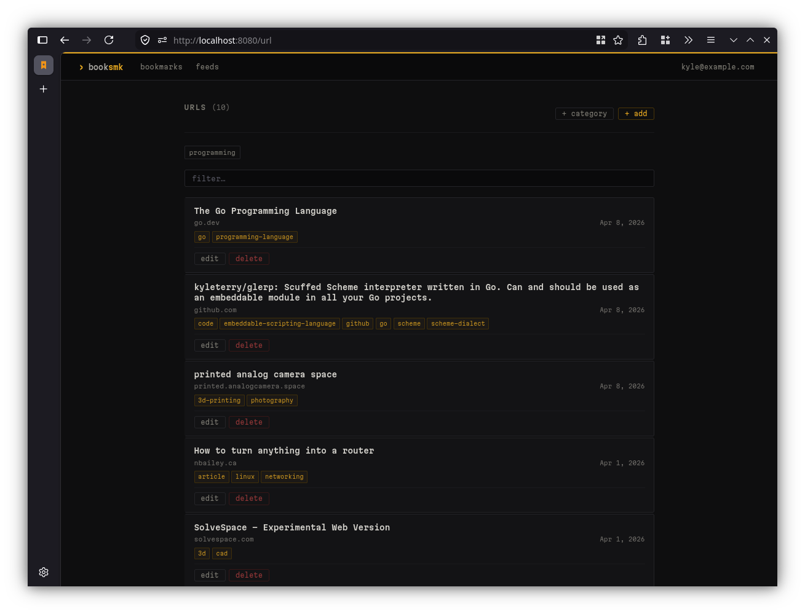
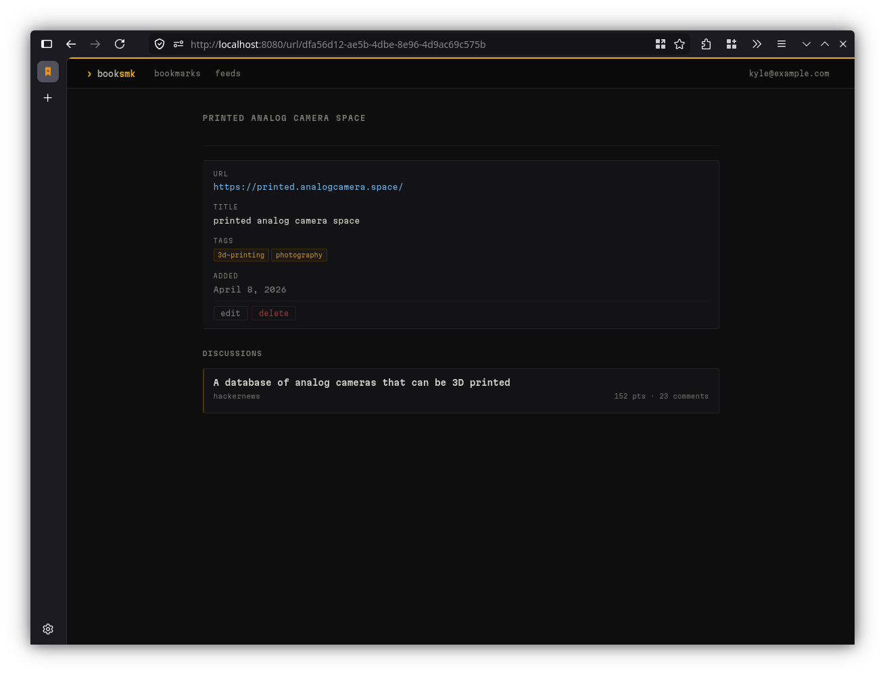
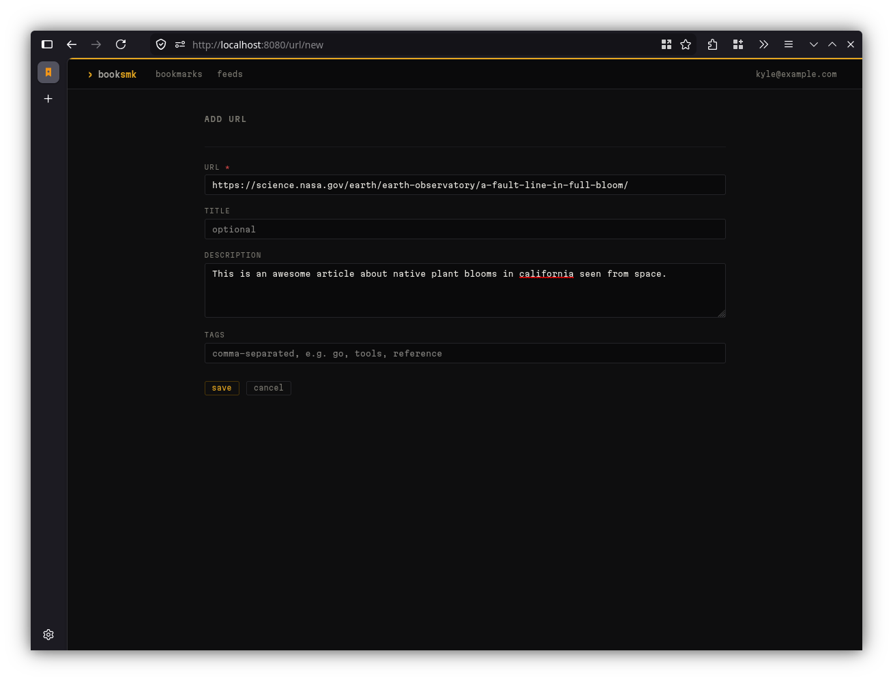
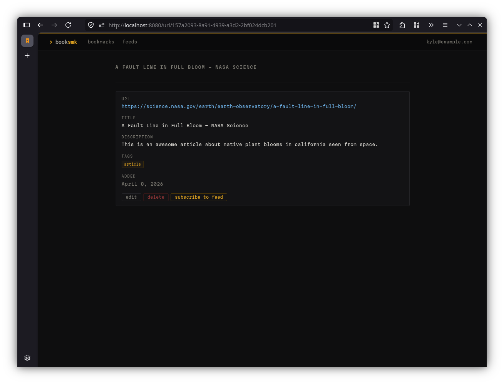
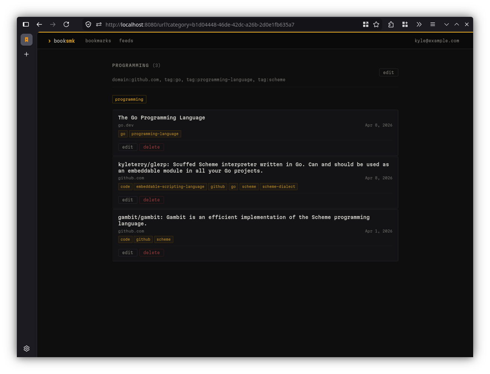
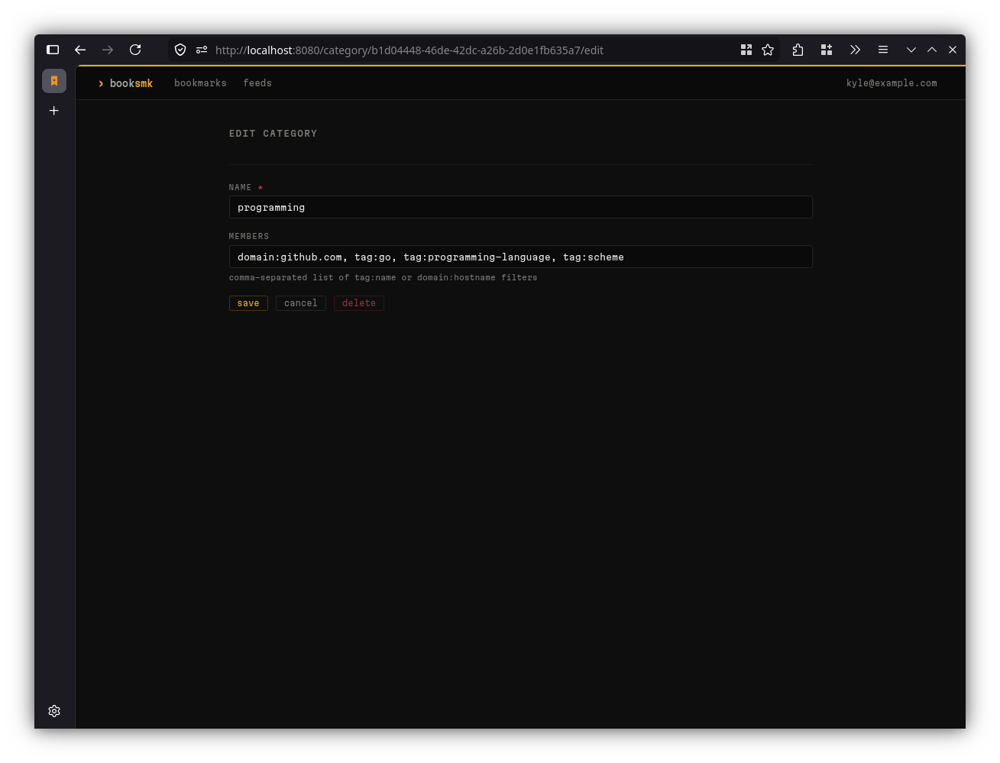
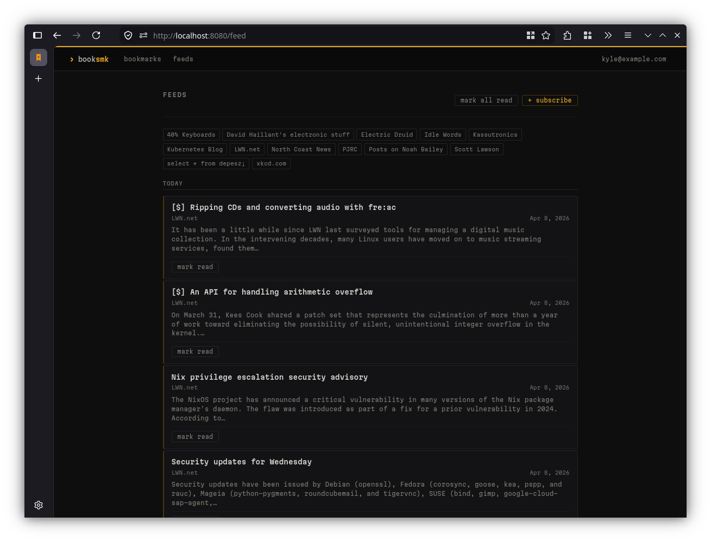
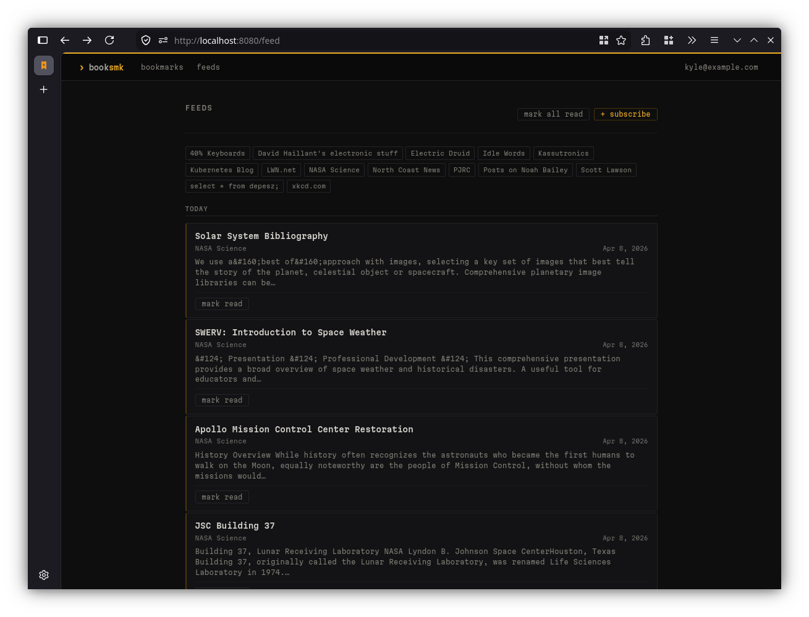
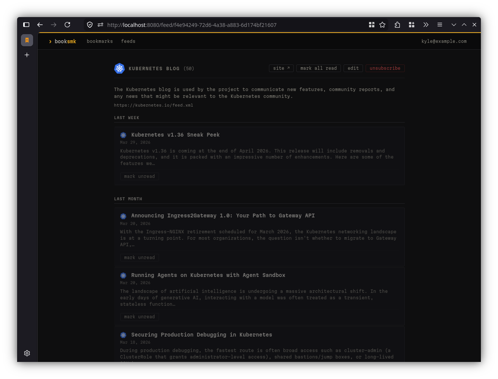
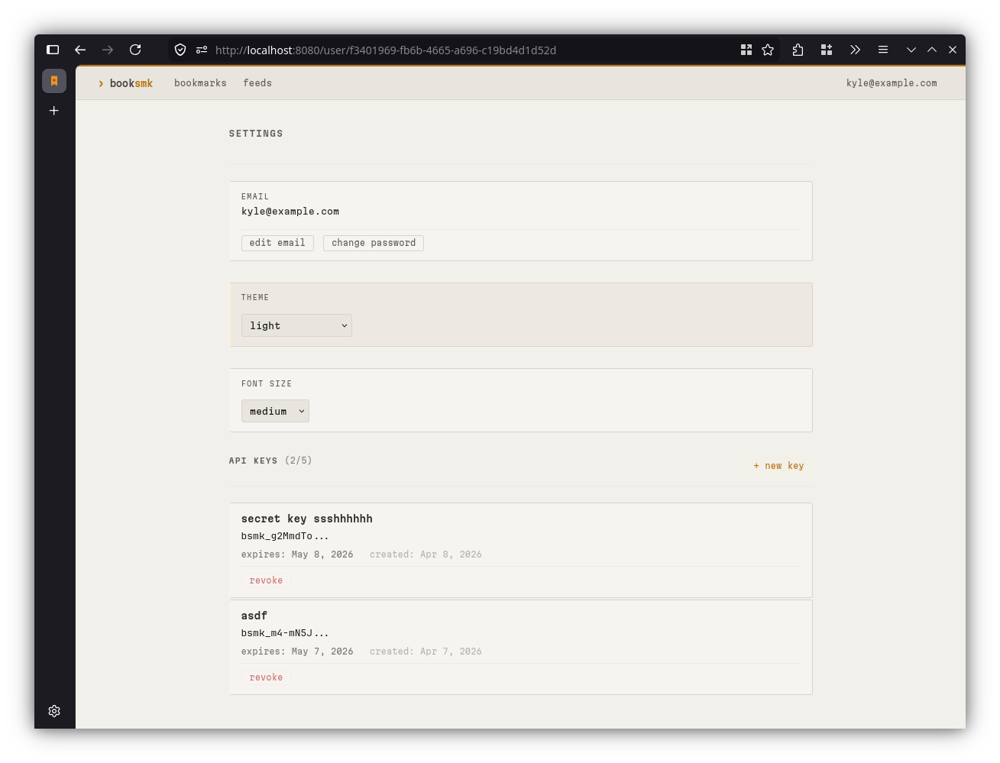

# Screenshots

## Bookmarks

### URL List

The main bookmarks view. Shows all saved URLs with titles, tags, and the date
added.

### URL Detail

Detail view for a single bookmark showing the URL, title, tags, and date added.
Also surfaces related discussions found on Hacker News.

### Add URL

Form for saving a new URL. The title field is optional; booksmk will fetch the
page title automatically if left blank. Tags are entered as a comma-separated
list.

### URL Detail with Feed Subscribe

When a saved URL has an associated RSS/Atom feed, a subscribe button appears on
the detail page. It tries its best to look for feed URLs in the page, but
sometimes it doesn't find them. I'm working on this... there's a lot of edge cases.

## Categories

### Category List

Categories group bookmarks by tag and domain filters. Each category acts as a
saved filter that aggregates matching URLs into a single view.

### Edit Category

Category editor where you define the name and member filters. Filters are
comma-separated expressions in the form `tag:name` or `domain:hostname`.

## Feeds

### Feed List

The feeds page lists all subscribed RSS/Atom feeds. Each entry shows the feed
title and source. Items can be marked read or saved as bookmarks.

### Feed Detail

Detail view for a single feed showing individual items with titles,
descriptions, and links.

## Settings

### User Settings (Light Mode)

User settings page showing email management, theme selection (light/dark), font
size, and API key management. API keys are used for programmatic access using
the `Autorization` header.

